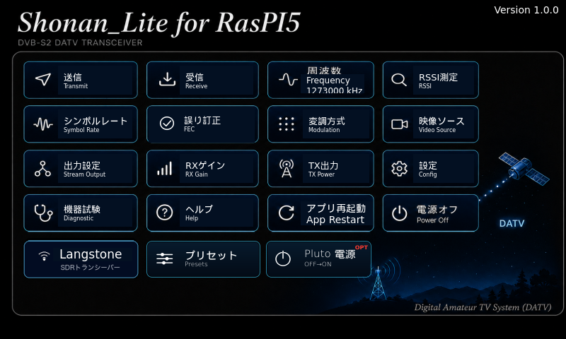
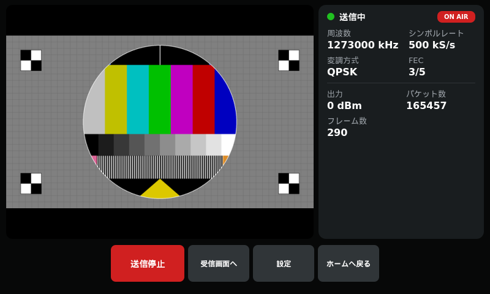
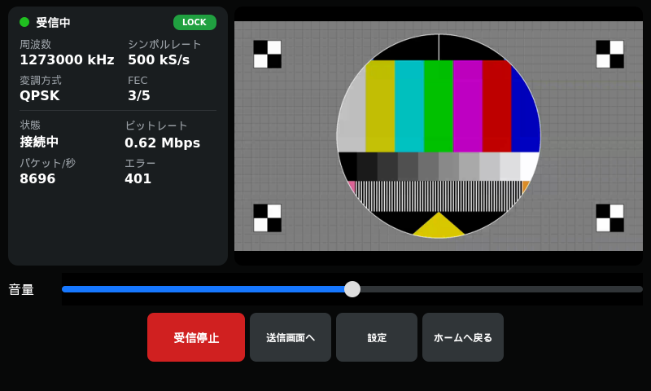
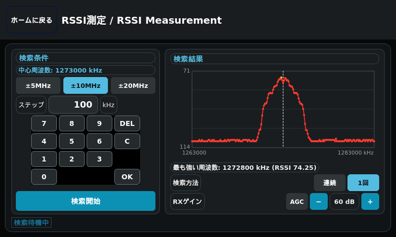
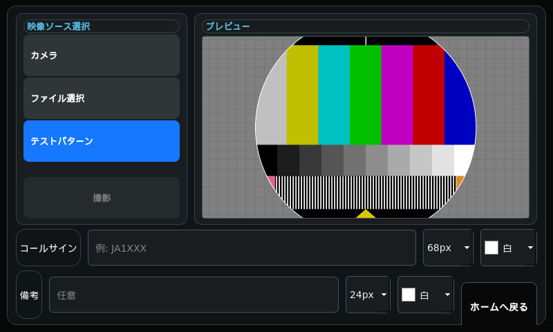
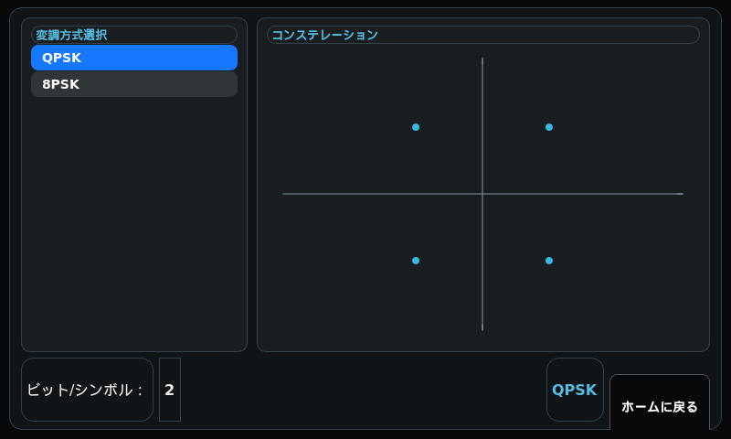
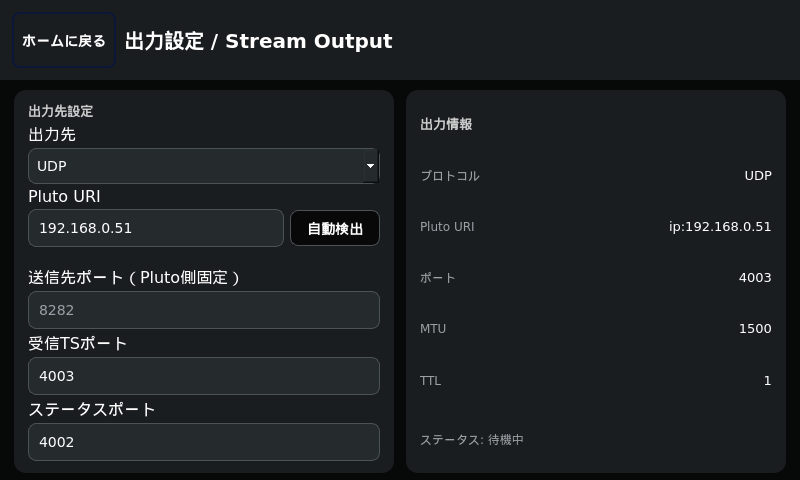
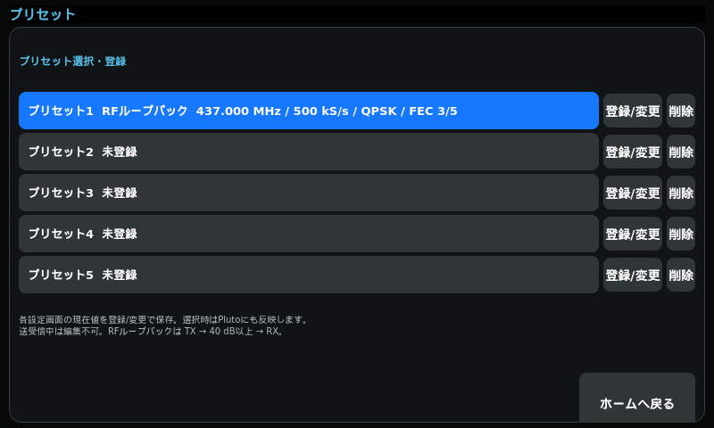

# Shonan for RasPI5

Raspberry Pi 5 + ADALM-PlutoによるDVB-S2 DATV送受信タッチGUIシステム。
本体は`pi5/`配下(Python/PyQt5、eglfs直描画)。

A touch-screen GUI system for DVB-S2 DATV transmission and reception using a Raspberry Pi 5 and an ADALM-Pluto.
The application lives under `pi5/` (Python/PyQt5, rendered directly via eglfs).

> 本READMEは日本語と英語を併記しています。各節で日本語の後に英語が続きます。
> This README is written in both Japanese and English. In each section, the Japanese text is followed by the English text.

> [!IMPORTANT]
> **Plutoのユーザー名(`root`)・パスワード(`analog`)はデフォルト値のまま変更しないでください。**
> 本アプリとLangstone V3は、SSHでPlutoにログインしてリブートしています(アプリ起動時・アプリ再起動・
> 機器試験・Langstone終了時)。変更するとPlutoをリブートできなくなります。
>
> **Keep the Pluto's username (`root`) and password (`analog`) at their default values.**
> This app and Langstone V3 log in to the Pluto via SSH to reboot it (at app start, app restart,
> equipment test and Langstone exit). If they are changed, the Pluto cannot be rebooted.

## 主な機能 / Features

- **送信**: 周波数・シンボルレート(333〜2000 kS/s)・FEC・変調方式(QPSK/8PSK)・TX出力を画面で設定し、
  Pluto内蔵の`pluto_dvb`でDVB-S2送信する。FECは変調方式ごとに実際に動作する組み合わせだけを選べる
  (QPSK: 1/2・3/5・8/9、8PSK: 3/5・8/9)。送信映像はフルHD(1920x1080)固定。
- **映像ソース**: USBカメラ・画像ファイル(静止画を反復送信)・テストパターンから選ぶ。カメラ選択時は
  「撮影」ボタンで静止画(JPG、`~/Pictures/Shonan_Lite/`)を撮り、そのまま送信画像に使える。
  コールサイン・備考を文字サイズ・文字色を選んで映像へ焼き込める(日時も表示)。
- **受信**: GNU Radio(gr-dvbs2rx)によるPi 5上での復調。LOCK状態・ビットレート・パケット数/エラー数を表示。
- **RSSI測定**: 周波数を掃引して受信レベルをグラフ表示する。オンデバイス復調OFF(通常運用)では
  相手局の電波を測り、ON(テスト用)では自局もテストパターンで自動送信して自分の信号を測る。
- **プリセット**: 現在の設定を5件まで登録・呼び出し(プリセット1は未登録の間RFループバック試験用)。
- **10GHz受信(LNB)**: Home画面の衛星をタップすると、Langstone V3を10236.5 MHz表示・
  Pluto受信486.5 MHz(LNB局部発振9750 MHz)の受信専用バンドで開く(下記参照)。
- **その他**: Pluto URIの自動検出、日本語/英語表示、日本語オンスクリーンキーボード、アプリ内Help、
  機器試験、起動時のアプリ選択(Shonan_Lite / Langstone V3)。

<!-- English -->

- **Transmit**: Set the frequency, symbol rate (333–2000 kS/s), FEC, modulation (QPSK/8PSK) and TX power on screen,
  and transmit DVB-S2 with `pluto_dvb` running inside the Pluto. Only FEC rates that actually work with each
  modulation can be selected (QPSK: 1/2, 3/5, 8/9; 8PSK: 3/5, 8/9). The transmitted video is fixed at Full HD (1920x1080).
- **Video source**: Choose from a USB camera, an image file (a still image transmitted repeatedly) or a test pattern.
  With the camera selected, the "Capture" button takes a still image (JPG, `~/Pictures/Shonan_Lite/`) that can be
  used directly as the transmit image. A callsign and a note can be burned into the video with a selectable
  text size and color (the date and time are shown as well).
- **Receive**: Demodulation on the Pi 5 with GNU Radio (gr-dvbs2rx). Shows LOCK status, bit rate and packet/error counts.
- **RSSI measurement**: Sweeps the frequency and graphs the received level. With on-device demodulation OFF
  (normal operation) it measures the other station's signal; with it ON (for testing) the station also transmits
  a test pattern automatically and measures its own signal.
- **Presets**: Save and recall up to 5 sets of settings (preset 1 is used for the RF loopback test while it is empty).
- **10 GHz reception (LNB)**: Tapping the satellite on the Home screen opens Langstone V3 on a receive-only band
  showing 10236.5 MHz, with the Pluto receiving at 486.5 MHz (LNB local oscillator 9750 MHz). See below.
- **Other**: Automatic Pluto URI detection, Japanese/English display, Japanese on-screen keyboard, in-app Help,
  equipment test, and application selection at boot (Shonan_Lite / Langstone V3).

## スクリーンショット / Screenshots

実機(7インチLCD、800x480)の画面。映像はすべてテストパターンで撮影している。

Screens from the actual device (7-inch LCD, 800x480). All video was captured using the test pattern.

| Home画面 / Home | 送信画面 / TX | 受信画面 / RX | RSSI測定 / RSSI |
| --- | --- | --- | --- |
|  |  |  |  |

| 映像ソース / Video source | 変調方式 / Modulation | 出力設定 / Stream output | プリセット / Presets |
| --- | --- | --- | --- |
|  |  |  |  |

各画面の操作方法は、アプリ内の「ヘルプ」または操作説明書
[`pi5/docs/shonan_pi5_operation_manual.docx`](pi5/docs/shonan_pi5_operation_manual.docx)を参照。

For how to operate each screen, see the in-app "Help" or the operation manual
[`pi5/docs/shonan_pi5_operation_manual.docx`](pi5/docs/shonan_pi5_operation_manual.docx) (in Japanese).

## インストール / Installation

### 事前に準備するもの / What you need

- Raspberry Pi 5本体
- microSDカードまたはNVMe SSD(Pi5の起動ストレージ)
- 書き込み用PC(Windows/Mac/Linuxいずれか)とmicroSDカードリーダー等
- ADALM-Pluto(DATVファームウェア導入済み)がPi5とEthernet同一ネットワークに
  接続されていること(★`install.sh`実行時点では未接続でもよい。あくまで
  ソフトウェア導入のみで、実運用時に必要)
- 送信映像用USBカメラ・オーディオ機器(任意、無くてもテストパターン映像で
  動作確認できる)

<!-- English -->

- A Raspberry Pi 5
- A microSD card or NVMe SSD (the Pi 5 boot storage)
- A PC for writing the image (Windows, Mac or Linux) and a microSD card reader, etc.
- An ADALM-Pluto (with DATV firmware installed) connected to the same Ethernet network as the Pi 5
  (★It does not need to be connected when running `install.sh`; that only installs software.
  It is required for actual operation.)
- A USB camera and audio devices for the transmitted video (optional; without them you can still
  check operation with the test pattern)

### 0. Raspberry Pi OSのインストール / Installing Raspberry Pi OS

Pi5本体に、あらかじめRaspberry Pi OSをインストールしておく。

1. PCで[Raspberry Pi Imager](https://www.raspberrypi.com/software/)を起動する。
2. 「デバイスを選択」で **Raspberry Pi 5** を選ぶ。
3. 「OSを選択」で **Raspberry Pi OS (64-bit)** を選ぶ
   (★32bit版は不可。下記「実行条件」参照)。
4. 「ストレージを選択」で書き込み先のmicroSD/NVMeを選ぶ。
5. 歯車アイコン(詳細設定)で、ホスト名・ユーザー名/パスワード・Wi-Fi・SSH有効化を
   事前設定しておくと、初回起動後すぐSSH接続できる。
6. 「書き込む」を実行し、完了後microSD/NVMeをPi5に取り付けて起動する。
7. PCから`ssh <ユーザー名>@<ホスト名>.local`で接続できることを確認する。

Install Raspberry Pi OS on the Pi 5 beforehand.

1. Launch [Raspberry Pi Imager](https://www.raspberrypi.com/software/) on your PC.
2. Under "Choose Device", select **Raspberry Pi 5**.
3. Under "Choose OS", select **Raspberry Pi OS (64-bit)**
   (★The 32-bit version is not supported. See "Requirements" below).
4. Under "Choose Storage", select the target microSD/NVMe.
5. If you preset the hostname, username/password, Wi-Fi and SSH in the gear icon (advanced options),
   you can connect via SSH right after the first boot.
6. Click "Write". When done, attach the microSD/NVMe to the Pi 5 and boot it.
7. Confirm that you can connect from your PC with `ssh <username>@<hostname>.local`.

### 0.5 Plutoのネットワーク設定(USB_ETHERNET) / Pluto network settings (USB_ETHERNET)

ADALM-Pluto(DATVファームウェア導入済み)をPi5と同じEthernetネットワークに
接続するには、あらかじめPluto側のUSB_ETHERNETインターフェースに固定IPを
設定しておく。

1. PlutoをPCとUSBケーブルで接続する(USB Mass Storageとして認識される)。
2. Plutoのドライブ直下にある`config.txt`をテキストエディタで開く。
3. `[USB_ETHERNET]`セクションの`ipaddr_eth`と`netmask_eth`を、Pi5と同じ
   サブネット内の値に設定する(例、Pi5が`192.168.0.80/24`の場合)。
4. `config.txt`を保存し、PlutoのドライブをPCから安全に取り出す(eject)。
   Plutoが自動的に再起動し、新しいIPアドレスで起動する。
5. Pi5の設定画面「送信先 (Pluto Tx)」に、ここで設定した`ipaddr_eth`の値
   (下記例では`192.168.0.51`)を入力する。

To connect the ADALM-Pluto (with DATV firmware) to the same Ethernet network as the Pi 5,
assign a static IP to the Pluto's USB_ETHERNET interface beforehand.

1. Connect the Pluto to your PC with a USB cable (it appears as a USB Mass Storage device).
2. Open `config.txt` in the root of the Pluto drive with a text editor.
3. Set `ipaddr_eth` and `netmask_eth` in the `[USB_ETHERNET]` section to values in the same subnet
   as the Pi 5 (example below for a Pi 5 at `192.168.0.80/24`).
4. Save `config.txt` and safely eject the Pluto drive from the PC.
   The Pluto reboots automatically and comes up with the new IP address.
5. Enter the `ipaddr_eth` value set here (`192.168.0.51` in the example below) into
   "Destination (Pluto Tx)" on the Pi 5 settings screen.

```ini
[USB_ETHERNET]
ipaddr_eth = 192.168.0.51
netmask_eth = 255.255.255.0
```

★Plutoのユーザー名(`root`)とパスワード(`analog`)は、工場出荷時のデフォルト値のまま
変更しないこと。Shonan_LiteとLangstone V3は、Plutoの再起動(アプリ起動時・アプリ再起動・
機器試験・Langstone終了時)と設定の読み出しに、このデフォルト値でSSH接続している。
変更するとPlutoを再起動できなくなる。

★Keep the Pluto's username (`root`) and password (`analog`) at the factory defaults.
Shonan_Lite and Langstone V3 connect to the Pluto via SSH with these defaults to reboot it
(at app start, app restart, equipment test and Langstone exit) and to read its settings.
If they are changed, the Pluto cannot be rebooted.

★USB直結時のUSB CDCネットワーク(`[NETWORK]`セクション、既定`192.168.2.1`)
とは別の設定である。`[USB_ETHERNET]`は、Pluto(Pluto+)のUSB OTGポートに
挿したUSB-Ethernetアダプタに割り当てるIPアドレスで、これによりPlutoが
Pi5と同じLAN(Ethernet)上のノードとして直接通信できるようになる。
設定ファイルの詳細は
[ADI公式Wiki](https://wiki.analog.com/university/tools/pluto/users/customizing)
を参照。

★This is separate from the USB CDC network used for a direct USB connection (the `[NETWORK]` section,
default `192.168.2.1`). `[USB_ETHERNET]` is the IP address assigned to a USB-Ethernet adapter plugged
into the Pluto (Pluto+) USB OTG port, which lets the Pluto communicate directly as a node on the same
LAN (Ethernet) as the Pi 5. For details of the configuration file, see the
[official ADI Wiki](https://wiki.analog.com/university/tools/pluto/users/customizing).

### 1. install.shの実行 / Running install.sh

本リポジトリはpublicのため、HTTPS clone(`install.sh`既定)でそのまま取得できる。
まずPi5へSSHでログインする(`<...>`の部分はご自身の環境の値に置き換える):

This repository is public, so it can be fetched as-is with an HTTPS clone (the `install.sh` default).
First log in to the Pi 5 via SSH (replace the `<...>` parts with values for your environment):

```sh
ssh <Pi5のユーザー名 / Pi 5 username>@<Pi5のIPアドレスまたはホスト名 / Pi 5 IP address or hostname>
# 例 / Example: ssh pi@192.168.0.80
```

ログイン後、Pi5上で:

After logging in, on the Pi 5:

```sh
# gitが未導入の場合は先に用意する(初回のみ)
# Install git first if it is not installed yet (first time only)
sudo apt-get update && sudo apt-get install -y git

git clone https://github.com/kazushinjo/Shonan_Lite-RasPI5.git
cd Shonan_Lite-RasPI5
./pi5/scripts/install.sh
```

`install.sh`自身も0/9でgit未導入の場合は自動導入する。以降のアップデート時も
このコマンドを再実行するだけでよい(`REPO_BRANCH`環境変数で取得するブランチを
指定できる。既定は`main`)。

`install.sh` itself also installs git automatically at step 0/9 if it is missing. For later updates,
simply re-run this command (the branch to fetch can be specified with the `REPO_BRANCH` environment
variable; the default is `main`).

★自分のフォークやプライベートなミラーからSSH経由で取得したい場合は、
`REPO_URL=git@github.com:<user>/<repo>.git ./pi5/scripts/install_ssh.sh`を使う
(SSH鍵が未登録ならその場で生成し、GitHubへの登録案内を表示して終了する)。

★To fetch from your own fork or a private mirror over SSH, use
`REPO_URL=git@github.com:<user>/<repo>.git ./pi5/scripts/install_ssh.sh`
(if no SSH key is registered, it generates one on the spot, shows instructions for registering it
with GitHub, and exits).

Pi5がGitHubへ到達できない環境(オフライン現場等)では、scp/USB等で転送済みの
ローカルクローンから展開する`install_local.sh`を使う(GitHubへのアクセスは
一切発生しない)。ソース取得部分がgit clone/pullではなくrsyncでのローカル
コピーに変わる以外は`install.sh`と同じ:

Where the Pi 5 cannot reach GitHub (e.g. offline sites), use `install_local.sh`, which installs from
a local clone already transferred via scp/USB etc. (no access to GitHub occurs at all). It is the same
as `install.sh` except that the source is obtained by a local rsync copy instead of git clone/pull:

```sh
./pi5/scripts/install_local.sh
```

さらに、PC側(Windows Git Bash/Mac/Linux)にあらかじめ作っておいたローカル
クローンから、Pi5への転送とインストールを1コマンドで行う`deploy_to_pi5.sh`
もある。PC側でこのリポジトリをclone済みの状態で:

There is also `deploy_to_pi5.sh`, which transfers and installs to the Pi 5 in a single command from a
local clone prepared on your PC (Windows Git Bash/Mac/Linux). With this repository cloned on the PC:

```sh
./pi5/scripts/deploy_to_pi5.sh
# Pi5のIPアドレス/ホスト名: 192.168.1.50   ← 入力 / enter
# Pi5のユーザー名 [pi]:                    ← 入力(空Enterでpi) / enter (empty Enter = pi)
```

を実行すると、Pi5のIPアドレス・ユーザー名の入力だけで、
1. ローカルクローンの中身(`.git`除く)をtar+ssh経由でPi5の`~/shonan-pi5-src`へ転送
2. Pi5上で`install_local.sh`を実行

まで自動で進む。追加ツール(sshpass/rsync)は使わず標準のssh/scp/tarのみで
動くため、Pi5への接続が発生する上記1・2のタイミングでそれぞれ標準のsshパス
ワードプロンプトが表示され、都度パスワードの入力が必要(合計2回。ビルドが
長時間に及ぶ場合、`sudo`のキャッシュが切れて追加でパスワードを求められる
こともある)。都度の入力自体を無くしたい場合はPi5にSSH公開鍵を登録し、
パスワード認証を使わない構成にする。

Just by entering the Pi 5 IP address and username, it automatically:
1. Transfers the contents of the local clone (excluding `.git`) to `~/shonan-pi5-src` on the Pi 5 via tar+ssh
2. Runs `install_local.sh` on the Pi 5

It uses only standard ssh/scp/tar with no extra tools (sshpass/rsync), so the standard ssh password
prompt appears at each of steps 1 and 2 above, where a connection to the Pi 5 is made, and you need
to enter the password each time (twice in total; if the build takes a long time, the `sudo` cache may
expire and ask for the password again). To avoid entering it every time, register an SSH public key
on the Pi 5 and do not use password authentication.

`SHONAN_INSTALL_DIR`・`SKIP_JA_KEYBOARD`・`SKIP_GNURADIO_BUILD`・
`SKIP_LANGSTONE_BUILD`をPC側で環境変数指定すると、Pi5側の`install_local.sh`
実行にもそのまま反映される:

Environment variables `SHONAN_INSTALL_DIR`, `SKIP_JA_KEYBOARD`, `SKIP_GNURADIO_BUILD` and
`SKIP_LANGSTONE_BUILD` set on the PC side are passed through to `install_local.sh` on the Pi 5:

```sh
SKIP_JA_KEYBOARD=1 SKIP_GNURADIO_BUILD=1 ./pi5/scripts/deploy_to_pi5.sh
```

日本語入力ビルド・受信(RX)用GNU Radio/gr-dvbs2rxビルド・Langstone V3ビルドは
それぞれ省略して時間短縮できる(省略した機能は使えなくなる):

The Japanese input build, the GNU Radio/gr-dvbs2rx build for reception (RX) and the Langstone V3
build can each be skipped to save time (skipped features will not be available):

```sh
SKIP_JA_KEYBOARD=1 SKIP_GNURADIO_BUILD=1 SKIP_LANGSTONE_BUILD=1 ./pi5/scripts/install.sh
```

環境変数で挙動を変更できる。

The behavior can be changed with environment variables.

| 変数 / Variable | 既定値 / Default | 効果 / Effect |
| --- | --- | --- |
| `SHONAN_INSTALL_DIR` | `$HOME/shonan-pi5` | リポジトリのclone/pull(またはコピー)先ディレクトリ<br>Directory the repository is cloned/pulled (or copied) into |
| `LOCAL_SOURCE_DIR` | (未設定 / unset) | 設定時、ソース取得をGitHubのclone/pullではなく指定ディレクトリからのrsyncコピーに切り替える(`install_local.sh`が自動設定)<br>When set, obtains the source by rsync copy from the given directory instead of clone/pull from GitHub (set automatically by `install_local.sh`) |
| `QTVK_BUILD_DIR` | `/tmp/qtvirtualkeyboard-src` | Qt Virtual Keyboardのビルド作業ディレクトリ<br>Build working directory for Qt Virtual Keyboard |
| `GR_DVBS2RX_BUILD_DIR` | `$HOME/gr-dvbs2rx` | gr-dvbs2rxのビルド作業ディレクトリ<br>Build working directory for gr-dvbs2rx |
| `SKIP_JA_KEYBOARD` | `0` | `1`で日本語入力ビルド(3/9)を省略<br>`1` skips the Japanese input build (3/9) |
| `SKIP_GNURADIO_BUILD` | `0` | `1`で受信(RX)用GNU Radio/gr-dvbs2rxビルド(4/9)を省略(受信機能は動作しなくなる)<br>`1` skips the GNU Radio/gr-dvbs2rx build for reception (4/9) (reception will not work) |
| `SKIP_LANGSTONE_BUILD` | `0` | `1`でLangstone V3のビルド(5/9)を省略<br>`1` skips the Langstone V3 build (5/9) |

`install.sh`は以下の9ステップを順に実行する(`set -euo pipefail`のため、
いずれかが失敗した時点で即座に停止する)。

`install.sh` runs the following 9 steps in order (because of `set -euo pipefail`, it stops
immediately as soon as any step fails).

| ステップ / Step | 内容 / Description |
| --- | --- |
| 0/9 | 前提条件の確認(git/SSH鍵の有無を確認し、無ければ案内して終了)<br>Check prerequisites (checks for git/SSH key; if missing, shows guidance and exits) |
| 1/9 | ソース取得(`git clone`または`git pull`)<br>Fetch the source (`git clone` or `git pull`) |
| 2/9 | 実行時依存パッケージのインストール(apt)<br>Install runtime dependency packages (apt) |
| 3/9 | 日本語入力(OpenWnn)対応版Qt Virtual Keyboardのビルド(既定で実施、実測10〜20分程度)<br>Build Qt Virtual Keyboard with Japanese input (OpenWnn) support (done by default, about 10–20 minutes measured) |
| 4/9 | 受信(RX)用GNU Radio + gr-dvbs2rxの導入<br>Install GNU Radio + gr-dvbs2rx for reception (RX) |
| 5/9 | Langstone V3(SDRトランシーバー)のビルド<br>Build Langstone V3 (SDR transceiver) |
| 6/9 | 起動時コンソール表示の抑制<br>Suppress the console display at boot |
| 7/9 | reboot/shutdown/起動アプリ切替のパスワード無し実行を許可(sudoers.d)<br>Allow reboot/shutdown/boot-app switching without a password (sudoers.d) |
| 8/9 | 電源電圧警告(稲妻アイコン)表示の抑制(`/boot/firmware/config.txt`)<br>Suppress the under-voltage warning (lightning icon) (`/boot/firmware/config.txt`) |
| 9/9 | systemdサービス登録(`shonan-gui.service`/`langstone.service`/`shonan-boot-menu.service`)<br>Register systemd services (`shonan-gui.service`/`langstone.service`/`shonan-boot-menu.service`) |

途中で通信・電源が切れない環境で実行すること。完了後、起動のたびに
「Shonan_Lite / Langstone V3」を選ぶ全画面メニュー
(`shonan-boot-menu.service`)が自動起動する。選んだ側の`shonan-gui.service`/
`langstone.service`をsystemdに登録・起動する。あわせて
`/boot/firmware/config.txt`へ`avoid_warnings=1`(電源電圧警告アイコンの表示抑制)
を未設定なら自動で追記する(反映には再起動が必要)。

Run it in an environment where the network and power will not be interrupted. After completion,
a full-screen menu for choosing "Shonan_Lite / Langstone V3" (`shonan-boot-menu.service`) starts
automatically at every boot, and the selected `shonan-gui.service`/`langstone.service` is registered
with systemd and started. It also appends `avoid_warnings=1` (suppresses the under-voltage warning
icon) to `/boot/firmware/config.txt` if not already set (a reboot is required for it to take effect).

### インストール後の確認 / After installation

インストールが終わったら、まず実機のホーム画面から「ヘルプ」を開いて
使い方を確認する。画面構成、送受信の基本操作、設定項目、トラブルシュー
ティング等の各章が実機の現在の仕様に合わせてまとまっている。

After installation, first open "Help" from the Home screen on the device and review how to use it.
Chapters on the screen layout, basic TX/RX operation, settings, troubleshooting and more are kept up
to date with the current behavior of the device.

## 実機LCDの画面キャプチャー / Capturing the device LCD screen

### アプリ内蔵のスクリーンショット機能(推奨) / Built-in screenshot function (recommended)

Shonan_Lite(GUI)は起動中、Unixドメインソケット`/tmp/shonan-pi5-gui.sock`でコマンドを受け付ける。
`screenshot`を送ると、表示中の画面を`/tmp/shonan_lcd_actual.png`に保存する(GUIは止まらない)。
`navigate:<画面名>`で任意の画面へ移動できる(画面名: `home` `tx` `rx` `frequency` `rssi`
`symbolrate` `fec` `modulation` `videosource` `streamoutput` `rxgain` `txpower` `manual`
`settings` `testequipment` `presets`)。

While running, Shonan_Lite (GUI) accepts commands on the Unix domain socket `/tmp/shonan-pi5-gui.sock`.
Sending `screenshot` saves the current screen to `/tmp/shonan_lcd_actual.png` (the GUI does not stop).
`navigate:<screen>` moves to any screen (screens: `home` `tx` `rx` `frequency` `rssi`
`symbolrate` `fec` `modulation` `videosource` `streamoutput` `rxgain` `txpower` `manual`
`settings` `testequipment` `presets`).

```bash
python3 -c "import socket,sys; s=socket.socket(socket.AF_UNIX); s.connect('/tmp/shonan-pi5-gui.sock'); s.sendall(sys.argv[1].encode()); s.close()" navigate:rssi
python3 -c "import socket,sys; s=socket.socket(socket.AF_UNIX); s.connect('/tmp/shonan-pi5-gui.sock'); s.sendall(sys.argv[1].encode()); s.close()" screenshot
```

起動直後は「アプリ起動時にPlutoも再起動しています…」の表示(最大25秒)が写ることがあるので、
起動から30秒ほど待ってから撮る。

Right after startup, the message "Rebooting the Pluto as the app starts…" (up to 25 seconds) may be
captured, so wait about 30 seconds after startup before taking a screenshot.

### kmsgrabによる取得 / Capturing with kmsgrab

Shonan_LiteはLCDへQt/DRMで直接描画しているため、`/dev/fb0`を読み出す方法では
起動コンソールなど、最終合成前の内容になることがある(素の色1色などになる)。
実際にLCDへ表示されている画面を取得する場合は、KMSのCRTC/Planeを指定して
`ffmpeg`の`kmsgrab`を使う。

Because Shonan_Lite draws directly to the LCD via Qt/DRM, reading `/dev/fb0` may give content from
before final composition, such as the boot console (e.g. a single plain color). To capture what is
actually displayed on the LCD, use `ffmpeg`'s `kmsgrab` specifying the KMS CRTC/Plane.

★`/dev/dri/card0`はモードセッティング非対応のスタブデバイスで、これを指定すると
`kmsgrab`が`Failed to set universal planes capability`/`Operation not supported`
で失敗する(実機で確認)。DSIパネルを実際に駆動しているのは**`/dev/dri/card1`**
なので、必ずこちらを指定する。

★`/dev/dri/card0` is a stub device without mode-setting support; specifying it makes `kmsgrab` fail
with `Failed to set universal planes capability`/`Operation not supported` (confirmed on the device).
The DSI panel is actually driven by **`/dev/dri/card1`**, so always specify that one.

まず実機で現在のCRTC/Plane IDを確認する(再起動などでIDが変わる場合がある):

First check the current CRTC/Plane IDs on the device (the IDs may change after a reboot, etc.):

```bash
kmsprint
```

現在の実機ではCRTC IDが`36`、Plane IDが`34`なので、以下でLCD画面をPNG化できる。
`sudo`のパスワード入力が必要になる。

On the current device the CRTC ID is `36` and the Plane ID is `34`, so the following saves the LCD
screen as a PNG. You will need to enter the `sudo` password.

```bash
sudo ffmpeg -y -hide_banner \
  -f kmsgrab -device /dev/dri/card1 \
  -crtc_id 36 -plane_id 34 -framerate 1 -i - \
  -vf hwdownload,format=bgr0 -frames:v 1 -update 1 /tmp/shonan_lcd_actual.png
```

MacなどのPCへコピーする:

Copy it to a PC such as a Mac:

```bash
scp pi@<Pi5のIPアドレス / Pi 5 IP address>:/tmp/shonan_lcd_actual.png \
  ~/Desktop/shonan_lcd_actual.png
```

`/dev/fb0`の直接取得は、LCDの最終表示を取得できない場合があるため、実機LCDの
スクリーンショットには使用しない。

Reading `/dev/fb0` directly may not capture the final LCD image, so do not use it for screenshots
of the device LCD.

### 実行条件 / Requirements

一般ユーザーが実行して`install.sh`が正常完了するには、以下が必要。

- **Raspberry Pi OS 64bit(aarch64)であること**(32bit版不可)
- **`git`が事前にインストール済み**であること
- **GitHub/apt配布ミラーへのインターネット到達性**
- **sudoが使える対話的な実行**(パスワード入力に応答できるtty)
- **`patch`コマンドが使えること**

詳細な各手順の解説・トラブルシュートは
[`pi5/docs/install_script_guide.md`](pi5/docs/install_script_guide.md)
(DOCX版: `pi5/docs/install_script_guide.docx`)を参照。

For `install.sh` to complete successfully when run by a regular user, the following are required:

- **Raspberry Pi OS 64-bit (aarch64)** (the 32-bit version is not supported)
- **`git` installed beforehand**
- **Internet access to GitHub and the apt mirrors**
- **Interactive execution with sudo available** (a tty that can answer password prompts)
- **The `patch` command available**

For a detailed explanation of each step and troubleshooting, see
[`pi5/docs/install_script_guide.md`](pi5/docs/install_script_guide.md)
(DOCX version: `pi5/docs/install_script_guide.docx`, in Japanese).

## Langstone V3(SDRトランシーバー)への切替 / Switching to Langstone V3 (SDR transceiver)

Pi5起動後にまず表示される「起動するアプリを選択してください」メニュー
(`shonan-boot-menu.service`)、またはShonan_Lite Home画面の「Langstone V3」
ボタンから、[g4eml/Langstone-V3](https://github.com/g4eml/Langstone-V3)
(VHF/UHF/マイクロ波帯SDRトランシーバー、ADALM-Pluto対応)へ切り替えられる。
Langstone V3はQt eglfsとは別に`/dev/fb0`を直接描画する独立アプリのため、
DATV送受信アプリとは同時起動できないが、**`shonan-gui.service`/
`langstone.service`/`shonan-boot-menu.service`がsystemdの`Conflicts=`で
互いに排他制御されているため、Pi5自体のrebootは不要**で
`systemctl start`だけで即座に切り替わる(以前はPi5ごとrebootしていたが、
`shonan-boot-menu.service`導入により不要になった)。

- Shonan_Lite Home画面の「Langstone V3」ボタン → Langstone V3が起動
  (現在稼働中のShonan_Liteプロセスはsystemdが自動停止)
- Langstone V3の設定メニュー内「BACK TO SHONAN_LITE」ボタン →
  Shonan_Lite Home画面に戻る

From the "Select the app to start" menu shown first after the Pi 5 boots (`shonan-boot-menu.service`),
or from the "Langstone V3" button on the Shonan_Lite Home screen, you can switch to
[g4eml/Langstone-V3](https://github.com/g4eml/Langstone-V3) (a VHF/UHF/microwave SDR transceiver
supporting the ADALM-Pluto). Langstone V3 is a standalone app that draws directly to `/dev/fb0`,
separately from Qt eglfs, so it cannot run at the same time as the DATV app. However,
**`shonan-gui.service`/`langstone.service`/`shonan-boot-menu.service` are mutually exclusive via
systemd `Conflicts=`, so no reboot of the Pi 5 is needed**; a `systemctl start` switches immediately
(previously the whole Pi 5 was rebooted, but this became unnecessary with `shonan-boot-menu.service`).

- "Langstone V3" button on the Shonan_Lite Home screen → Langstone V3 starts
  (systemd automatically stops the running Shonan_Lite process)
- "BACK TO SHONAN_LITE" button in the Langstone V3 settings menu →
  returns to the Shonan_Lite Home screen

切替時にPluto(とPA_Power/PTTコントローラの12V電源)は**再起動しない**
(以前は切替のたびにPlutoを再起動しており、数十秒かかっていた)。実機試験で、
DATV→Langstone→DATVとPlutoを再起動せずに切り替えても、Langstoneの送受信と
DATVの送受信(オンデバイス復調による自局信号のロック)が正常に動くことを確認した。
ただしLangstoneは受信中にPlutoの送信LO(`altvoltage1`)をpowerdownしたまま終了し、
そのままではDATV送信の電波が出ないため、「GOTO SHONAN_LITE」で戻るときは
Langstone側とShonan_Lite側の両方で送信LOを元に戻す。
Langstoneからの切替であることは`/tmp/shonan_switch_from_langstone`で伝え、
Shonan_Liteはこれがあるときだけ起動時のPluto再起動を省く(使ったら消すので、
その後のアプリ再起動やPi5の電源投入時は従来どおり再起動する)。Langstone側の
`run_pluto`は`/tmp/langstone_goto_shonan`があるとき、終了後のPluto再起動を省く。Plutoが`fmcomms2_source: Unable to refill buffer`のように
詰まった場合は、Home画面の「アプリ再起動」(Plutoも再起動する)で復旧できる。

The Pluto (and the 12 V supply of the PA_Power/PTT controller) is **not rebooted** when switching
(previously the Pluto was rebooted on every switch, which took tens of seconds). Device testing
confirmed that after switching DATV → Langstone → DATV without rebooting the Pluto, both Langstone
TX/RX and DATV TX/RX (locking onto the station's own signal with on-device demodulation) work
correctly. However, Langstone exits with the Pluto's TX LO (`altvoltage1`) still powered down while
receiving, which would leave DATV transmission with no RF output, so when returning via
"GOTO SHONAN_LITE" both the Langstone side and the Shonan_Lite side restore the TX LO.
A switch from Langstone is signaled by `/tmp/shonan_switch_from_langstone`, and Shonan_Lite skips the
Pluto reboot at startup only when it exists (it is deleted after use, so later app restarts and Pi 5
power-ups reboot the Pluto as before). On the Langstone side, `run_pluto` skips the Pluto reboot after
exiting when `/tmp/langstone_goto_shonan` exists. If the Pluto gets stuck, e.g. with
`fmcomms2_source: Unable to refill buffer`, it can be recovered with "Restart App" on the Home screen
(which also reboots the Pluto).

内部的には`~/.pi5_boot_mode_langstone`マーカーファイルの有無をsystemdの
`ConditionPathExists`で判定し、`shonan-gui.service`/`langstone.service`の
どちらを起動すべきかを決める(ブート時だけでなく、アプリ内からの切替時にも
マーカーを書き換えてから対象サービスを直接startする)。

Internally, systemd's `ConditionPathExists` checks for the `~/.pi5_boot_mode_langstone` marker file
to decide whether `shonan-gui.service` or `langstone.service` should start (not only at boot; when
switching from within an app, the marker is rewritten and the target service is started directly).

ウォーターフォール/スペクトラム表示は幅約512px→約790pxへ拡張済み
(FFT点数自体はGNU Radio側のfft_size=512のまま、SCALEPX()マクロで描画のみ
引き伸ばしている。帯域インジケータ・目盛り・タッチ判定も含め一貫して変換)。
横方向にはSQLボタン(x=30〜130)/Volボタン(x=660〜)と同じY帯で重なり広げる
余地が無かったため、スペクトラム欄の高さ(80→55px)とウォーターフォールの
表示履歴行数(130→90行)を縮めて表示位置を上に詰め、SQL/Vol/RITいずれとも
Y方向に重ならない帯(Y=130〜295)に収めることで横方向をほぼ画面全幅まで
広げた(実機で確認、詳細は下記パッチ参照)。
詳細は
[`pi5/docs/patches/langstone_v3_shonan_lite.patch`](pi5/docs/patches/langstone_v3_shonan_lite.patch)
(upstream差分)を参照。

The waterfall/spectrum display has been widened from about 512 px to about 790 px
(the number of FFT points stays at fft_size=512 on the GNU Radio side; only the drawing is stretched
by the SCALEPX() macro, applied consistently to the bandwidth indicator, scale and touch detection).
Since there was no room to widen it horizontally in the same Y band as the SQL button (x=30–130) and
Vol button (x=660–), the spectrum area height (80 → 55 px) and the number of waterfall history rows
(130 → 90) were reduced and the display moved up, fitting it into a band (Y=130–295) that does not
overlap SQL/Vol/RIT vertically, which allows it to extend to nearly the full screen width (confirmed
on the device). For details, see
[`pi5/docs/patches/langstone_v3_shonan_lite.patch`](pi5/docs/patches/langstone_v3_shonan_lite.patch)
(diff against upstream).

`g4eml/Langstone-V3`本家が更新された場合、`pi5/third_party/Langstone-V3/`を
直接上書きすると上記の改造が失われる。
[`pi5/scripts/update_langstone_from_upstream.sh`](pi5/scripts/update_langstone_from_upstream.sh)
を実行すると、本家を読み取り専用でclone → このパッチを適用 →
成功した場合のみ`pi5/third_party/Langstone-V3/`を置き換える(本家への
書き込みは一切行わない)。パッチが当たらない場合は改造箇所と本家の変更が
衝突しているため、エラーで止まり手動マージが必要になる。

When upstream `g4eml/Langstone-V3` is updated, overwriting `pi5/third_party/Langstone-V3/` directly
would lose the modifications above. Running
[`pi5/scripts/update_langstone_from_upstream.sh`](pi5/scripts/update_langstone_from_upstream.sh)
clones upstream read-only → applies this patch → replaces `pi5/third_party/Langstone-V3/` only if
that succeeds (nothing is ever written to upstream). If the patch does not apply, the modifications
conflict with upstream changes; it stops with an error and a manual merge is required.

### 10GHz受信(LNB) — Home画面の衛星をタップ / 10 GHz reception (LNB) — tap the satellite on the Home screen

Home画面の背景右側の衛星をタップすると、Langstone V3を**10GHz受信用のバンド**で
開く(普通の「Langstone」カードと同じく、Plutoは再起動しない)。アンテナ側で
**LNB(局部発振 9750 MHz)**により周波数を下げて受信する前提の設定で、
LangstoneのトランスバーターのオフセットとしてLNBの局部発振周波数を設定している。

Tapping the satellite on the right side of the Home screen background opens Langstone V3 on a
**band for 10 GHz reception** (as with the normal "Langstone" card, the Pluto is not rebooted).
The settings assume the frequency is down-converted at the antenna by an **LNB (local oscillator
9750 MHz)**, and the LNB local oscillator frequency is set as Langstone's transverter offset.

| 項目 / Item | 値 / Value |
| --- | --- |
| 画面の表示周波数<br>Displayed frequency | 10236.500 MHz(10.2365 GHz、画面に「XVTR」と表示)<br>10236.500 MHz (10.2365 GHz, "XVTR" shown on screen) |
| Plutoの受信周波数<br>Pluto receive frequency | 486.5 MHz(= 10236.5 − 9750) |
| 受信オフセット<br>Receive offset | −9750 MHz(LNB 局部発振 9750 MHz)<br>−9750 MHz (LNB local oscillator 9750 MHz) |
| 受信モード<br>Receive mode | 固定しない(Langstoneの「MODE」でUSB/FM/CW等を選べる)<br>Not fixed (USB/FM/CW etc. can be selected with Langstone's "MODE") |
| 送信<br>Transmit | **不可**(受信専用)<br>**Not possible** (receive only) |

- Langstoneの24バンドのうち、通常使われない最後のバンド(番号23、画面上は24番目)を
  このために使う。衛星をタップするたびに、Shonan_Liteが`~/Langstone/Langstone_Pluto.conf`
  のこのバンドを上の値に設定し直してから開く([`pi5/gui/langstone_config.py`](pi5/gui/langstone_config.py))。
- 486.5 MHzはアマチュアバンド外のため、このバンドは**受信専用**
  (設定ファイルの`bandRxOnly23 1`、Langstone側の改造)。画面のPTT・ハードウェアPTT・
  CWキー・ビーコンのいずれでも送信せず、PA_Power/PTTコントローラも送信に切り替えない。
  PTTボタンは灰色の「RX ONLY」表示になり、Plutoの送信LOも停止させる。
- 普通の「Langstone」カードで開いたときは、衛星から開く前に使っていたバンドに戻して開く
  (Langstone上で別のバンドに切り替えていた場合は、そのバンドのまま)。
- LNBへの電源供給(同軸経由のバイアスT、12〜18 V)はShonan_Lite/Langstoneでは扱わない。
  別途用意すること。

<!-- English -->

- Of Langstone's 24 bands, the last one, which is not normally used (number 23, the 24th on screen),
  is used for this. Every time the satellite is tapped, Shonan_Lite resets this band in
  `~/Langstone/Langstone_Pluto.conf` to the values above before opening
  ([`pi5/gui/langstone_config.py`](pi5/gui/langstone_config.py)).
- Because 486.5 MHz is outside the amateur bands, this band is **receive only**
  (`bandRxOnly23 1` in the configuration file, a modification on the Langstone side). It does not
  transmit from the on-screen PTT, hardware PTT, CW key or beacon, and does not switch the
  PA_Power/PTT controller to transmit. The PTT button is shown grayed out as "RX ONLY", and the
  Pluto's TX LO is also stopped.
- When opened from the normal "Langstone" card, it returns to the band that was in use before opening
  from the satellite (if you switched to another band in Langstone, it stays on that band).
- Power for the LNB (bias-T over the coax, 12–18 V) is not handled by Shonan_Lite/Langstone.
  Provide it separately.

## 関連ドキュメント / Related documents

- [`pi5/docs/install_script_guide.md`](pi5/docs/install_script_guide.md) — install.shの詳細ガイド / Detailed guide to install.sh
- [`pi5/docs/qtvirtualkeyboard_ja_build.md`](pi5/docs/qtvirtualkeyboard_ja_build.md) — 日本語オンスクリーンキーボードのビルド手順・ハマりどころ / Build steps and pitfalls for the Japanese on-screen keyboard
- [`pi5/docs/shonan_pi5_operation_manual.docx`](pi5/docs/shonan_pi5_operation_manual.docx) — 操作説明書(各画面のスクリーンショット付き) / Operation manual (with screenshots of each screen)
- [`pi5/gui/manual_content.py`](pi5/gui/manual_content.py) — アプリ内Helpの内容(章データ)。操作説明書もこれから生成する / Content of the in-app Help (chapter data); the operation manual is also generated from it
- [`pi5/docs/build_operation_manual.py`](pi5/docs/build_operation_manual.py) — 操作説明書(DOCX)の生成スクリプト / Script that generates the operation manual (DOCX)
  (`python pi5/docs/build_operation_manual.py`、python-docxが必要 / requires python-docx)
- [`pi5/third_party/rpi-dvbs2-receiver-gui/`](pi5/third_party/rpi-dvbs2-receiver-gui/) — GNU Radio/gr-dvbs2rx受信フローグラフの参考実装(kazushinjo/rpi-dvbs2-receiver-guiより取り込み) / Reference implementation of the GNU Radio/gr-dvbs2rx receive flowgraph (imported from kazushinjo/rpi-dvbs2-receiver-gui)

## クレジット / Credits

- 受信部の方式考案・受信部原システム設計: 山崎慎慈氏(JE1BTA)
  rpi-dvbs2-receiver-guiの設計に基づきます
- 受信部安定化調査修正・再捕捉修正・本アプリ開発: 真城和一
- Langstone V3(SDRトランシーバー): [g4eml/Langstone-V3](https://github.com/g4eml/Langstone-V3)
  (オリジナルから一部変更しています。差分は
  [`pi5/docs/patches/langstone_v3_shonan_lite.patch`](pi5/docs/patches/langstone_v3_shonan_lite.patch)を参照)

<!-- English -->

- Reception method and original reception system design: Shinji Yamazaki (JE1BTA),
  based on the design of rpi-dvbs2-receiver-gui
- Reception stability investigation and fixes, re-acquisition fixes, and development of this app: Kazuichi Shinjo
- Langstone V3 (SDR transceiver): [g4eml/Langstone-V3](https://github.com/g4eml/Langstone-V3)
  (partially modified from the original; see
  [`pi5/docs/patches/langstone_v3_shonan_lite.patch`](pi5/docs/patches/langstone_v3_shonan_lite.patch) for the diff)

## License

本ソフトウェアはGNU General Public License v3.0(GPLv3)の下で提供されます。
ライセンス全文: [LICENSE](LICENSE)

This software is licensed under the GNU General Public License v3.0 (GPLv3).
Full license text: [LICENSE](LICENSE)

- Langstone V3 (SDR transceiver, [g4eml/Langstone-V3](https://github.com/g4eml/Langstone-V3)): GPLv3
- Reception subsystem design (Shinji Yamazaki, JE1BTA): GPLv3
- Application development, reception stability fixes (Kazuichi Shinjo): GPLv3
